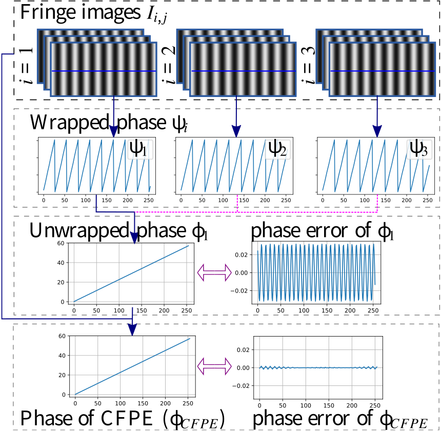
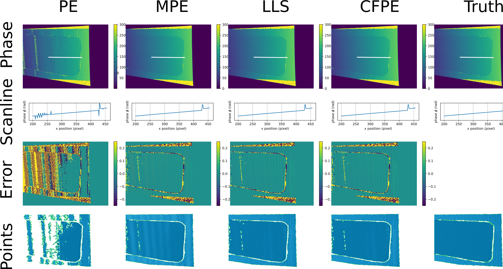
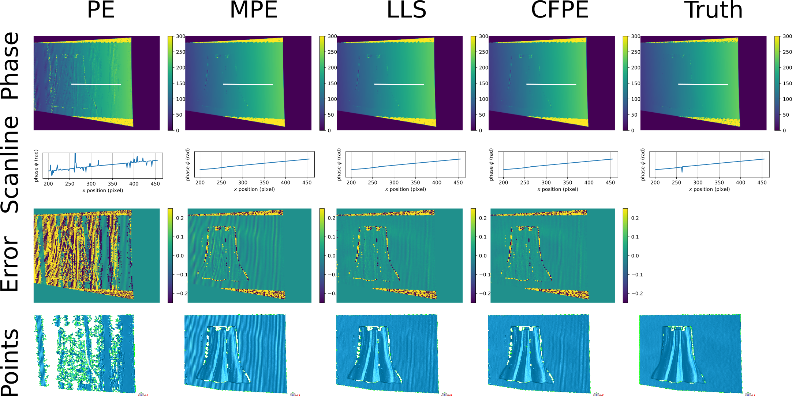
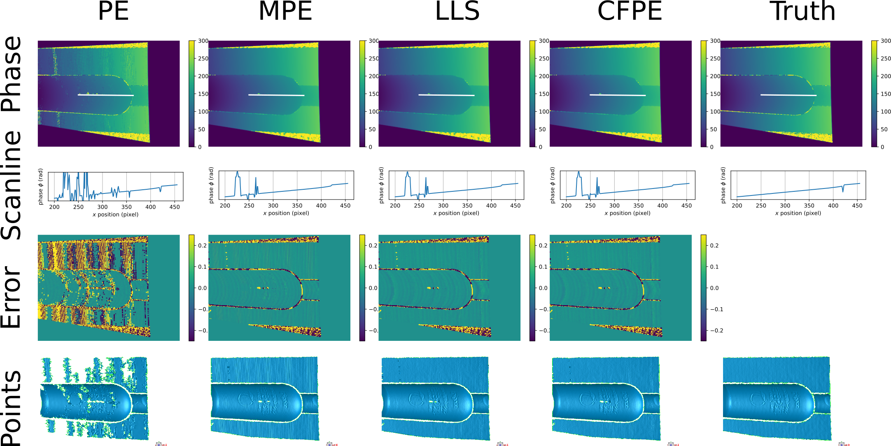

# Combined-frequency Phase Extraction (CFPE) 


[](https://opg.optica.org/oe/abstract.cfm?doi=10.1364/OE.473513)
[](https://opensource.org/licenses/MIT)


This repository contains code for the paper *[A fast combined-frequency phase extraction for phase shifting profilometry](https://doi.org/10.1364/OE.473513)*. 
In this work, we formulate the phase extraction problem with high-order harmonic as a maximum likelihood estimation (MLE), and our CFPE is an efficient optimization method by introducing a latent phase map and incorporating the expectation-maximization (EM) framework.
Compared to the only high-order baseline (LLS), our CFPE method only needs **  about 5% execution time  ** to achieve high-order accuracy.
### Motivation 


As a special curve fitting problem, our CFPE utilizes more data points (cross-frequency images) to solve a high-order harmonic model. That says, $\theta^* =\arg\min \Sigma_i\Sigma_j (I_{i,j}-h_{i,j})^2 $. 

Our CFPE reports an efficient iterative solution to this problem $\phi_1^{new}=update(\phi_1^{old})$, and each iteration is computed with closed-form solution. More info is referred to the paper.


## Install dependencies
```
conda install numpy matplotlib opencv seaborn
conda install -c anaconda pathlib
```


## The experiments
* [Exp1.ipynb](https://github.com/yongleex/CFPE/blob/main/Exp1_synthesis.ipynb): Test on several synthetic PSP images;
* [Exp2.ipynb](https://github.com/yongleex/CFPE/blob/main/Exp2_real.ipynb): Test on 4 real PSP cases;
* [Exp3.ipynb](https://github.com/yongleex/CFPE/blob/main/Exp3_for_review.ipynb): Compare the two interesting cases, with the same gamma distortion ($\gamma=1.3$),
  1. Our CFPE method with 3-frequency 3-step images (periods T1=33, T2=36, T3=39);
  2. Standard PE method with 1-frequency 9-step images (T=1920);

### More results about the real cases
- Plate

- Altman cloak

- David

- Pigeon bottle 


### BibTeX

```
@article{lee2022cfpe,
  author={Lee, Yong and Mao, Ya and Chen, Zuobing},  
  journal={Optics Express},  
  title={Fast combined-frequency phase extraction for phase shifting profilometry},  
  year={2022},
  volume={30},
  number={25},
  pages={45288--45300},
  doi={https://doi.org/10.1364/OE.473513}}
```

### Questions?
For any questions regarding this work, please email me at [yongli.cv@gmail.com](mailto:yongli.cv@gmail.com), [yonglee@whut.edu.cn](mailto:yonglee@whut.edu.cn).

#### Acknowledgements
These works are contributed to our CFPE project,

* [LLS](https://doi.org/10.1364/OE.384155)
* [Industrial Camera from hikrobotics](https://www.hikrobotics.com/cn/machinevision/visionproduct?typeId=27&id=259)
* [XGIMI Home projector](https://www.xgimi.com/)
